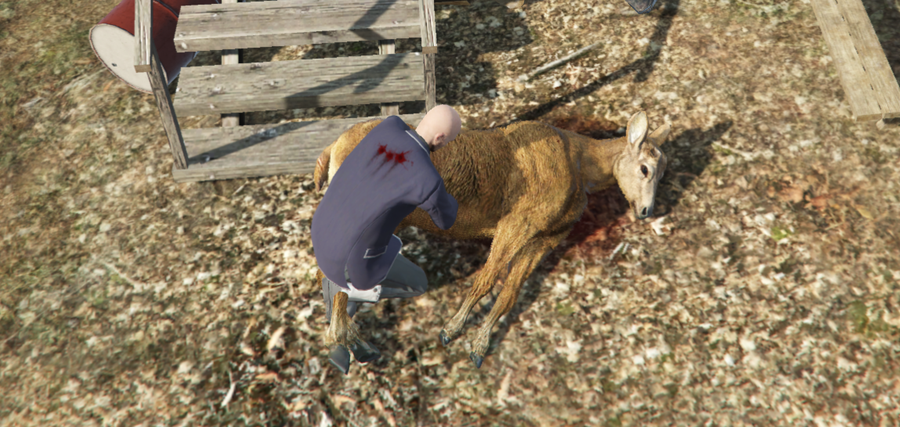
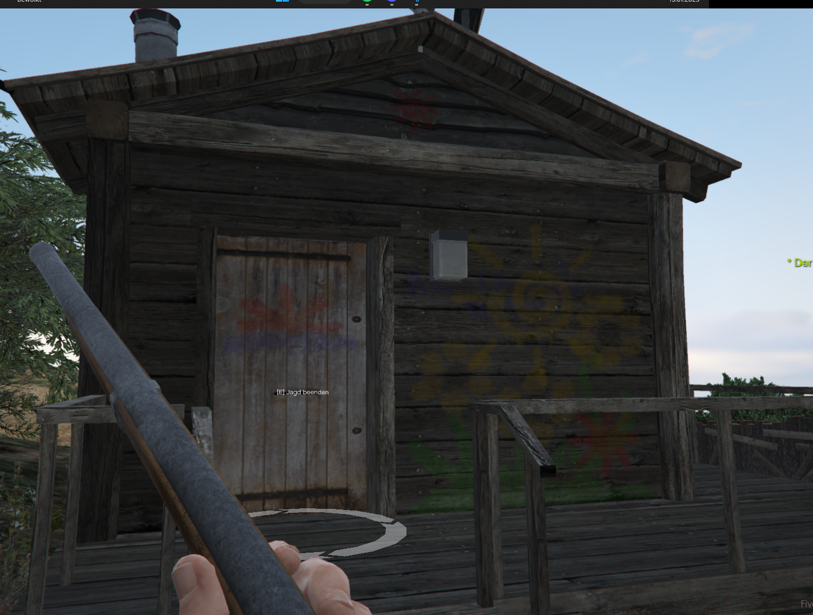
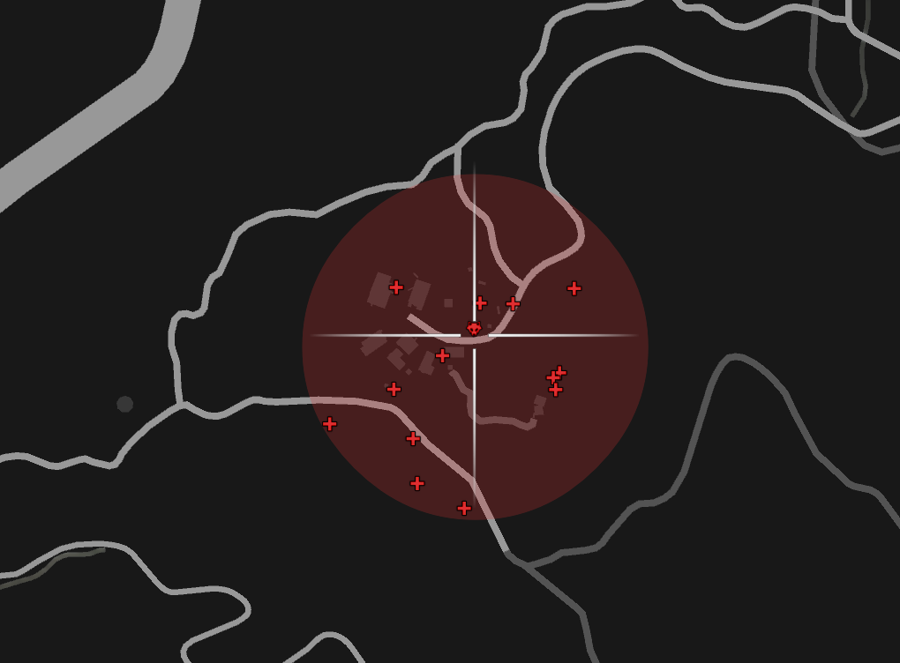

<a name="readme-top"></a>

<!-- PROJECT LOGO -->
<br />
<div align="center">
  <a href="https://discord.gg/G9zzDPvF4Y">
    
  </a>
  
  <h3 align="center">LifePeak - Skripts</h3>
  
  <a href="https://tinyurl.com/lifepeak">
   </img>

  </a>

  <p align="center">
    Any fool can write code that a computer can understand. Good programmers write code that humans can understand!
    <br />
    <a href="https://lifepeak-scripts.tebex.io"><strong>Explore us on Tebex  »»</strong></a>
    <br />
    <br />
    <a href="https://www.youtube.com/channel/UC8tftArZtDQz_0bohnnidoA">View Demos</a>
    ·
    <a href="https://discord.gg/G9zzDPvF4Y">Report Bug</a>
    ·
    <a href="https://discord.gg/G9zzDPvF4Y">Request Feature</a>
  </p>
</div>


<!-- TABLE OF CONTENTS 
<details>
  <summary>Table of Contents</summary>
  <ol>
    <li>
      <a href="#about-the-project">About The Project</a>
      <ul>
        <li><a href="#built-with">Built With</a></li>
      </ul>
    </li>
    <li>
      <a href="#getting-started">Getting Started</a>
      <ul>
        <li><a href="#prerequisites">Prerequisites</a></li>
        <li><a href="#installation">Installation</a></li>
      </ul>
    </li>
    <li><a href="#usage">Usage</a></li>
    <li><a href="#roadmap">Roadmap</a></li>
    <li><a href="#contributing">Contributing</a></li>
    <li><a href="#license">License</a></li>
    <li><a href="#contact">Contact</a></li>
    <li><a href="#acknowledgments">Acknowledgments</a></li>
  </ol>
</details>
-->


<!-- ABOUT THE PROJECT -->
## Explore Lifepeak
### What's Lifepeak-Scripts?
Lifepeak is a small developing team of three members. We are specialized in Five-M Scripting, Hosting, Managing Servers.


### What we offer ?

This section list our Supported Programming Languages and Frameworks.

### Programming Languages:


### Frameworks:


--------------
<p align="right">(<a href="#readme-top">back to top</a>)</p>

### Which Platforms we're supporting?
We're currently supporting this platforms if you have any Questions regarding Linux or Windows feel free to contact us.


## Interested? Find us on:

 * [](https://discord.gg/G9zzDPvF4Y)
 * [](https://discord.gg/G9zzDPvF4Y)
 * [](https://gitlab.lifepeak.de/lifepeak-freescripts)
 * [](https://lifepeak.de/)

<!-- GETTING STARTED -->
# lp_hunting

lp hunting is a simple hunting script where you go to a Hunting-Range and can start huning there you get weapon after some time random Animals spawn at the nearst hunting area. The script is fully configurable so can change all things like Hunting Ranges, Animals, Loots, Sell Points, Weapons or the starting Vehicle.

Working with lp_notify. :) https://scripts.lifepeak.de/package/5124963


### Preview
<a href="./preview/butcher.png">

</a>
<a href="./preview/firstperson.png">

</a>
<a href="./preview/map.png">

</a>
<a href="./preview/overview.png">

</a>
<a href="./preview/shooting.png">

</a>

### Installation
0. Check Requirements
      - [ ] es_extended
1. Download the Script at the Tebex [Lifepeak-Tebex](https://scripts.lifepeak.de/)
2. Customize the config
```lua
    Config = {}
    Config.Locale  = 'de'
    Config.ReqireHuntingJob = false
    Config.HuntingWeapon = "WEAPON_MUSKET"
    Config.SpawnJobVehicle = true
    Config.JobVehicle = "blazer"
    Config.Animals = {
        [1] = {
            ['model'] = "a_c_boar",
            ['probability'] = 0.1, --  = 10%
            ['loot'] = {
                meat=5,  -- maximum item number
                leather=2, -- maximum item number
            }
        },
        [2] = {
            ['model'] = "a_c_deer",
            ['probability'] = 0.3, --  = 30%
            ['loot'] = {
                meat=5,  -- maximum item number
                leather=2, -- maximum item number
            }
        },
        [3] = {
            ['model'] = "a_c_coyote",
            ['probability'] = 0.3, --  = 30%
            ['loot'] = {
                meat=5,  -- maximum item number
                leather=2, -- maximum item number
            }
        },
        [4] = {
            ['model'] = "a_c_husky",
            ['probability'] = 0.3, --  = 30%
            ['loot'] = {
                meat=5,  -- maximum item number
                leather=2, -- maximum item number
            }
        },
        [5] = {
            ['model'] = "a_c_pig",
            ['probability'] = 0.3, --  = 30%
            ['loot'] = {
                meat=5,  -- maximum item number
                leather=2, -- maximum item number
            }
        },
        [6] = {
                ['model'] = "a_c_pig",
                ['probability'] = 0.3, --  = 30%
                ['loot'] = {
                    meat=5,  -- maximum item number
                    leather=2, -- maximum item number
                }
        },
        [7] = {
                ['model'] = "a_c_rabbit_01",
                ['probability'] = 0.3, --  = 30%
                ['loot'] = {
                    meat=1,  -- maximum item number
                    leather=3, -- maximum item number
                }
            }
        }
    }

    Config.HuntingAreaRanges = {
        [1] = {
            ["coord"]= vector3(-1058.492310, 4899.758301, 211.864502),
            ["radius"] = 25.0
        },
        [2] = {
            ["coord"]= vector3(1,1,1),
            ["radius"] = 460
    }

    Config.Mensions = {
        StartHunting = {
            vector3(-1058.8522949219, 4915.3295898438,211.81875610352),
        },
        Sell = {
            vector3(-1073.894531, 4898.505371, 214.257202),
        }
    }

Config.Notification = {}
Config.Notification.System = 'lp_notify' -- none / lp_notify
Config.Notification.displaytime = 1300 --ms
Config.Notification.Postion = "top right" -- Only works lp_notify! | lp_"top right", [top Left, top Right, bottom Left, bottom Right}
```
3. Insert the items.sql in your FiveM database
4. Add the staring command to your server.cfg
   ```cfg
   start lp_hunting
   ```

<p align="right">(<a href="#readme-top">back to top</a>)</p>


<!-- USAGE EXAMPLES -->
## Usage
1. Go to the nearest Hunting Range.
2. Go to the start Point press `E`
3. Wait untill the Animals are spawned, go hunting :)
4. Whenn your finished go back to the start point.
5. Go to the start Point press `E` to stop hunnting
6. Find the nearest butcher and sell your goods.

<p align="right">(<a href="#readme-top">back to top</a>)</p>


<!-- CONTRIBUTING 
## Contributing

Contributions are what make the open source community such an amazing place to learn, inspire, and create. Any contributions you make are **greatly appreciated**.

If you have a suggestion that would make this better, please fork the repo and create a pull request. You can also simply open an issue with the tag "enhancement".
Don't forget to give the project a star! Thanks again!

1. Fork the Project
2. Create your Feature Branch (`git checkout -b feature/AmazingFeature`)
3. Commit your Changes (`git commit -m 'Add some AmazingFeature'`)
4. Push to the Branch (`git push origin feature/AmazingFeature`)
5. Open a Pull Request

<p align="right">(<a href="#readme-top">back to top</a>)</p>
-->
